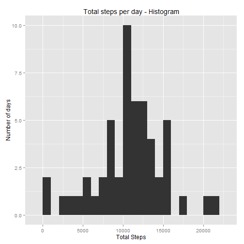
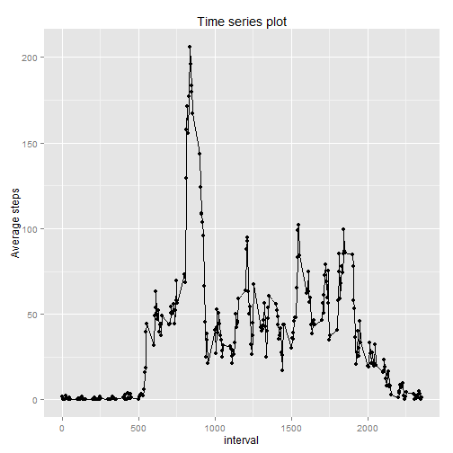
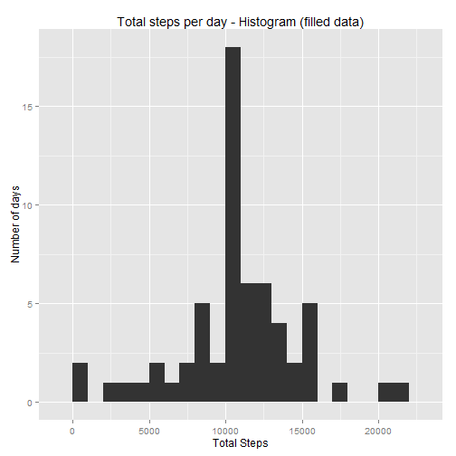
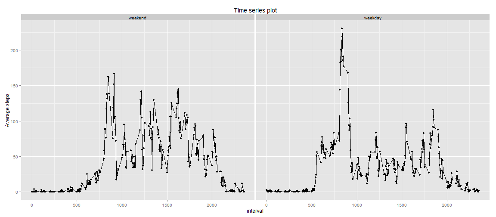

# Reproducible Research: Peer Assessment 1

## Loading and preprocessing the data

We load data using `read.csv()` and convert the date column into dates.


```r
activity_data <- read.csv(unz('activity.zip', 'activity.csv'),
                          stringsAsFactor = FALSE)
# Convert Date to date types
activity_data[, 2] = as.Date(activity_data[, 2])
```

## What is mean total number of steps taken per day?

### Histogram of the total number of steps taken each day


```r
steps_by_days <- aggregate(steps ~ date, data = activity_data, sum,
                           na.rm = TRUE)

library(ggplot2)
qplot(steps, data = steps_by_days, geom = 'histogram',
    xlab = "Total Steps", ylab = "Number of days",
    main = "Total steps per day - Histogram", binwidth = 1000)
```

 

### Mean and median of total number of steps taken per day


```r
step_mean <- mean(steps_by_days$steps)
step_median <- median(steps_by_days$steps)
```
* The mean number of steps taken per day = 1.0766189 &times; 10<sup>4</sup>
* The median number of steps taken per day = 10765


## What is the average daily activity pattern?

### Time series plot of 5-minute interval and average number of steps taken


```r
steps_by_interval <- aggregate(steps ~ interval,
                               data = activity_data,
                               mean, na.rm = TRUE)
qplot(data = steps_by_interval, x = interval, y = steps,
    ylab = "Average steps", main = "Time series plot") + geom_line()
```

 

### 5-minute interval containing the maximum number of steps


```r
max_interval <- steps_by_interval[which.max(steps_by_interval$steps),]$interval
```
The 5 minute interval that contains the maximum number of steps is
835.

## Imputing missing values

### Total number of missing values in the dataset


```r
missing_vals <- sum(is.na(activity_data))
```
There are 2304 missing values in the dataset.

### Strategy for filling in missing values

We could use the strategy of filling in missing values with mean for that
 interval. The function to get steps given interval is as follows:


```r
intervalToSteps <- function(interval) {
    steps_by_interval[steps_by_interval$interval == interval, ]$steps
}
```

### New dataset with missing values filled in

We create a new dataset with missing values filled in.


```r
# Make a copy of dataset
filled_activity_data <- activity_data
for (i in 1:nrow(filled_activity_data)) {
    if (is.na(filled_activity_data[i, ]$steps)) {
        filled_activity_data[i, ]$steps <-
            intervalToSteps(filled_activity_data[i, ]$interval)
    }
}
```

### Analysis on Imputing

#### Histogram with clean data


```r
filled_steps_by_days <- aggregate(steps ~ date, data = filled_activity_data,
                                  sum, na.rm = TRUE)

qplot(steps, data = filled_steps_by_days, geom = 'histogram',
    xlab = "Total Steps", ylab = "Number of days",
    main = "Total steps per day - Histogram (filled data)", binwidth = 1000)
```

 

#### Mean and median of total number of steps taken per day, in clean data


```r
filled_step_mean <- mean(filled_steps_by_days$steps)
filled_step_median <- median(filled_steps_by_days$steps)
```
* The mean number of steps taken per day, in the filled dataset
= 1.0766189 &times; 10<sup>4</sup>, where as the mean was 1.0766189 &times; 10<sup>4</sup> in original data
* The median number of steps taken per day, in the filled dataset
= 1.0766189 &times; 10<sup>4</sup>, where as the median was
10765 in original data

## Are there differences in activity patterns between weekdays and weekends?

### Weekday factor in filled data


```r
filled_activity_data$day <- ifelse(
    as.POSIXlt(filled_activity_data$date)$wday%%6 == 0, 'weekend', 'weekday')
filled_activity_data$day <- factor(filled_activity_data$day,
                                  levels = c('weekend', 'weekday'))
```

### Panel plot with time series plot comparing weekends and weekdays


```r
library(lattice)
steps_by_interval_days <- aggregate(steps ~ interval + day,
                               data = filled_activity_data,
                               mean, na.rm = TRUE)

# To get the plot as displayed in Coursera
# xyplot(steps ~ interval | factor(day), data = steps_by_interval_days,
#       aspect = 1/2, type = "l")

qplot(data = steps_by_interval_days, x = interval, y = steps, facets = ~ day,
    ylab = "Average steps", main = "Time series plot") + geom_line()
```

 
